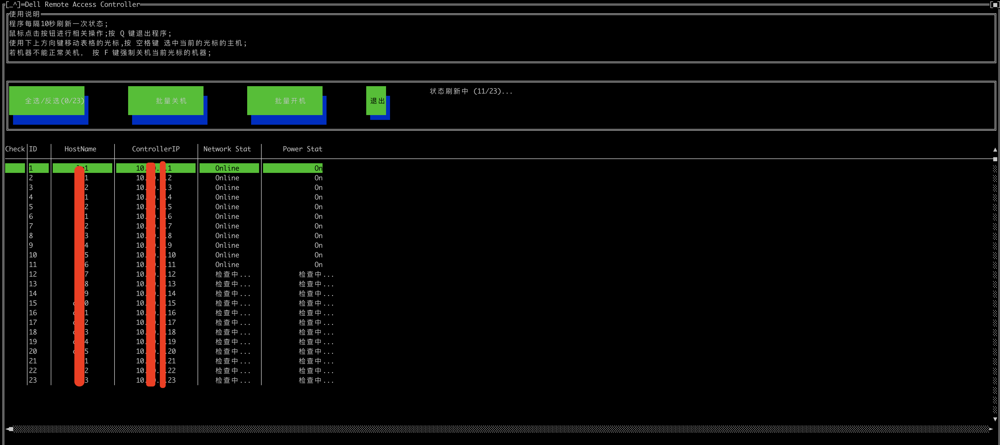

使用 golang 开发的 dell-remote-access-controller 管理界面，可以在一个界面批量管理多台机器。

## 开发环境
  * go 1.21.6

## 编译程序
安装编译工具：
```
apk add build-base
```
安装依赖： `cd app; go mod download`
编译程序： `go build src/main.go`

## 使用方法
直接运行编译生成的 `main` 程序。在当前目录下创建一个 `.config.json` 文件，内容配置格式如下：
```
[
  {"HostName": "<机器别名>",  "ControllerIP": "<DRAC的 ip>",  "username": "<账号>", "password": "<密码>"},
]
```


